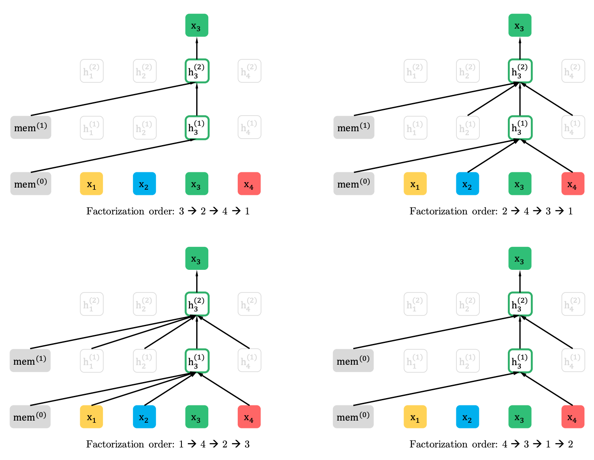
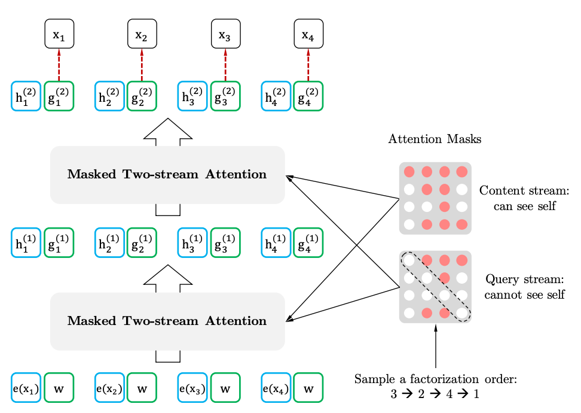

## XLNet-Pytorch [arxiv:1906.08237](https://arxiv.org/pdf/1906.08237.pdf)

**Simple XLNet implementation with Pytorch Wrapper!**

#### You can see How XLNet Architecture work in pre-training with small batch size(=1) example.

#### To Usage

```shell
$ git clone https://github.com/graykode/xlnet-Pytorch && cd xlnet-Pytorch

# To use Sentence Piece Tokenizer(pretrained-BERT Tokenizer)
$ pip install pytorch_pretrained_bert

$ python main.py --data ./data.txt --tokenizer bert-base-uncased \
   --seq_len 512 --reuse_len 256 --perm_size 256 \
   --bi_data True --mask_alpha 6 --mask_beta 1 \
   --num_predict 85 --mem_len 384 --num_step 100
```

Also, You can run code in [Google Colab](https://colab.research.google.com/github/graykode/xlnet-Pytorch/blob/master/XLNet.ipynb) easily.

- Hyperparameters for Pretraining in Paper.

<p align="center"> </p>


#### Option

- `—data`(String) : `.txt` file to train. It doesn't matter multiline text. Also, one file will be one batch tensor. Default : `data.txt`
- `—tokenizer`(String) : Sentence Piece Tokenizer(pretrained-BERT Tokenizer). I just used [huggingface/pytorch-pretrained-BERT's Tokenizer](https://github.com/huggingface/pytorch-pretrained-BERT) because both(BERT, XLNet) use the sentence piece. you can choose in `bert-base-uncased`, `bert-large-uncased`, `bert-base-cased`, `bert-large-cased`. Default : `bert-base-uncased`
- `—seq_len`(Integer) : Sequence length. Default : `512`
- `—reuse_len`(Interger) : Number of token that can be reused as memory. Could be half of `seq_len`. Default : `256`
- `—perm_size`(Interger) : the length of longest permutation. Could be set to be reuse_len. Default : `256`

- `--bi_data`(Boolean) : whether to create bidirectional data. If `bi_data` is `True`, `biz(batch size)` should be even number. Default : `False`
- `—mask_alpha`(Interger) : How many tokens to form a group. Defalut : `6`
- `—mask_beta`(Integer) : How many tokens to mask within each group. Default : `1`
- `—num_predict`(Interger) : Num of tokens to predict. In Paper, it mean Partial Prediction. Default : `85`
- `—mem_len`(Interger) : Number of steps to cache in Transformer-XL Architecture. Default : `384`
- `—number_step`(Interger) : Number of Step(Epoch). Default : `100`


## What is XLNet?

**XLNet** is a new unsupervised language representation learning method based on a novel generalized permutation language modeling objective. Additionally, XLNet employs [Transformer-XL](https://arxiv.org/abs/1901.02860) as the backbone model, exhibiting excellent performance for language tasks involving long context.

- [XLNet: Generalized Autoregressive Pretraining for Language Understanding](https://arxiv.org/abs/1906.08237)
- [Paper Author's XLNet Github](https://github.com/zihangdai/xlnet)

| Model | MNLI     | QNLI     | QQP      | RTE      | SST-2    | MRPC     | CoLA     | STS-B    |
| ----- | -------- | -------- | -------- | -------- | -------- | -------- | -------- | -------- |
| BERT  | 86.6     | 92.3     | 91.3     | 70.4     | 93.2     | 88.0     | 60.6     | 90.0     |
| XLNet | **89.8** | **93.9** | **91.8** | **83.8** | **95.6** | **89.2** | **63.6** | **91.8** |


### Keyword in XLNet

1. How did XLNet benefit from Auto-Regression and Auto-Encoding models?

   - Auto-Regression  Model
     
   - Auto-Encoding Model
     

2. Permutation Language Modeling with Partial Prediction
   - Permutation Language Modeling
    
   
- Partial Prediction
  
  
3. Two-Stream Self-Attention with Target-Aware Representation

   - Two-Stram Self-Attention

     

   - Target-Aware Representation

     


## Author

- Because the original repository is subject to the **Apache2.0 license**, it is subject to the same license.
- Tae Hwan Jung(Jeff Jung) @graykode, Kyung Hee Univ CE(Undergraduate).
- Author Email : [nlkey2022@gmail.com](mailto:nlkey2022@gmail.com)